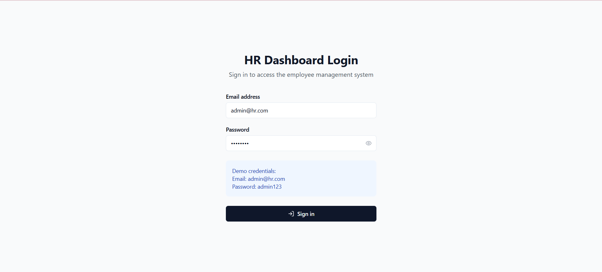
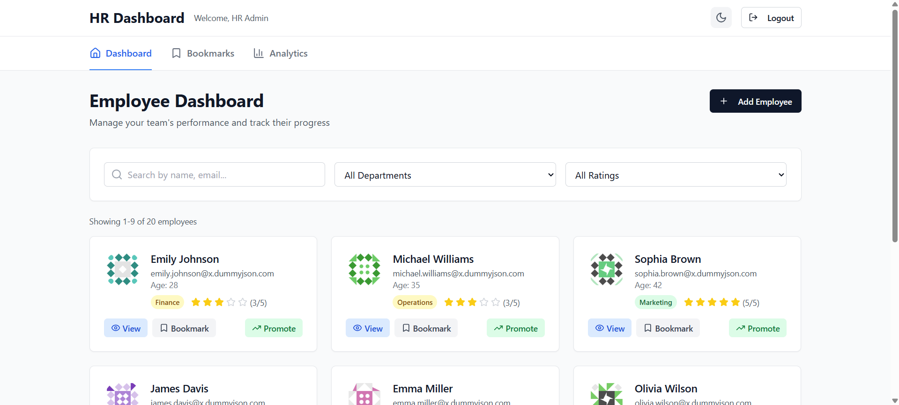
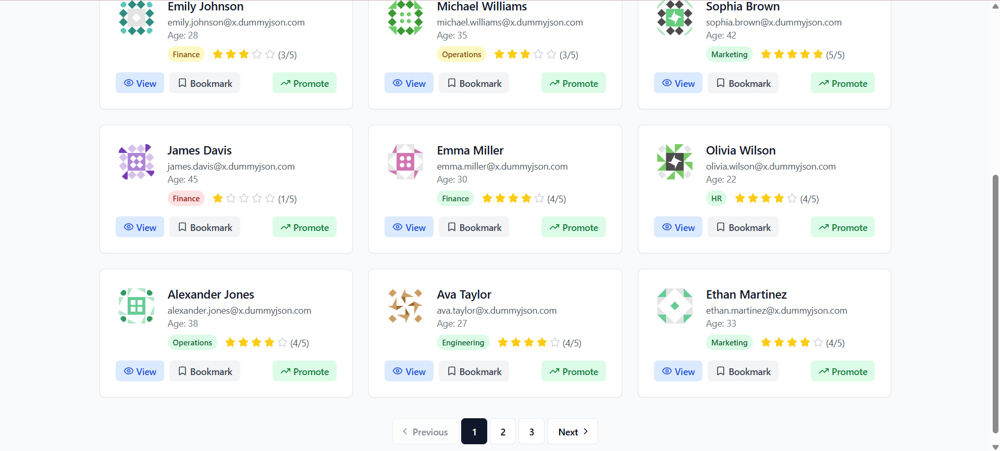
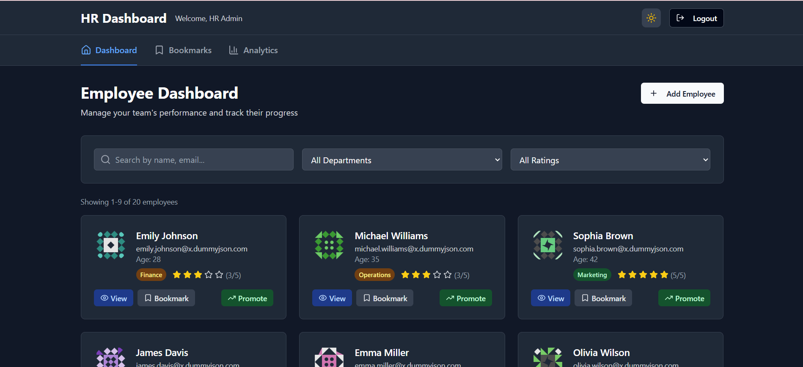
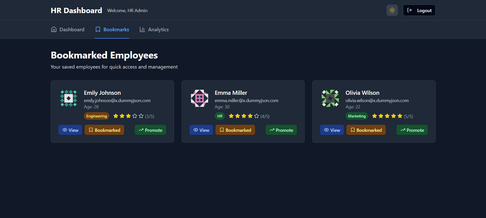
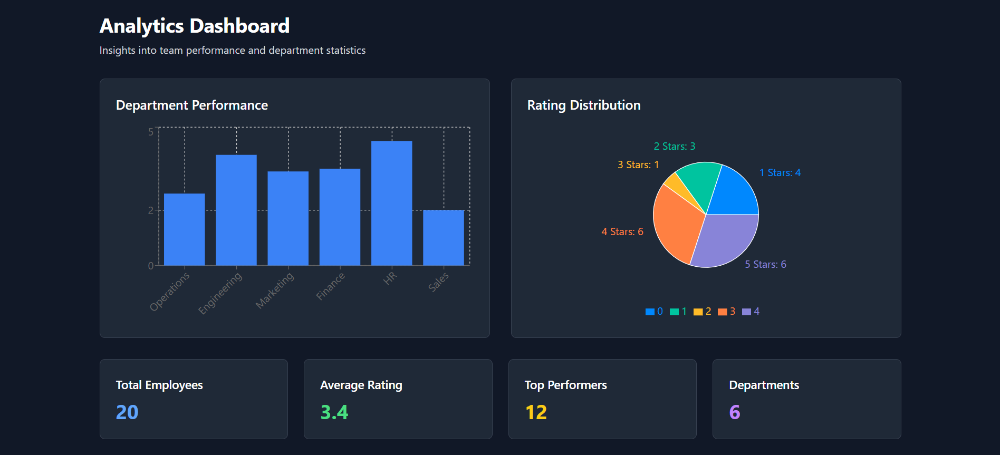

# HR-Dashboard

A modern and responsive HR Dashboard built using **Next.js**, **Tailwind CSS**, and **Zustand** for state management. This project aims to visualize employee data, track KPIs, and provide meaningful insights for HR professionals.

---

## 🚀 Features Implemented

- 📊 Interactive charts & graphs for employee data
- 🔍 Search and filter functionalities
- 🌙 Light/Dark theme support
- 🧩 Modular component architecture
- 🧠 State management using Zustand
- 🖥️ Responsive UI for desktop and mobile

---

## 📷 Screenshots


*Login Page*


*Main HR Dashboard*


*Employee Management Section*


*Dark Theme*


*Employee Bookmark Section*


*Analytics Section*

---

## 🛠️ Setup Instructions

### Prerequisites

- Node.js & npm installed ([Install Node.js](https://nodejs.org))
- Git installed ([Install Git](https://git-scm.com))

### Steps

```bash
# 1. Clone the repository
git clone https://github.com/nikhitha1188/HR-Dashboard.git

# 2. Navigate into the project folder
cd HR-Dashboard

# 3. Install dependencies
npm install

# 4. Start the development server
npm run dev
